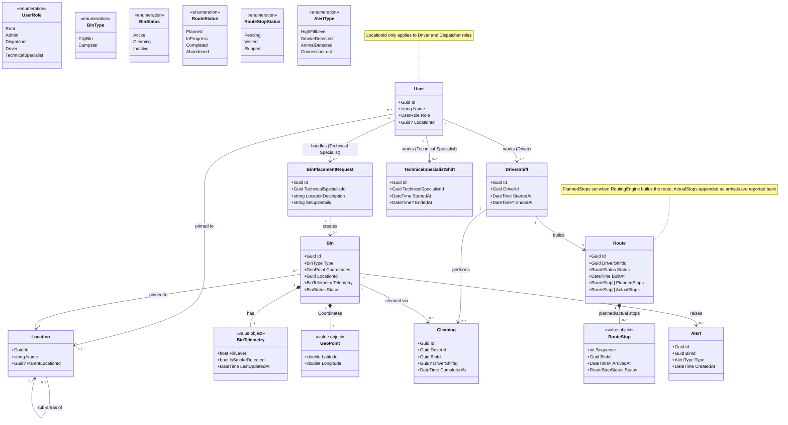

# Data Model

Self-hosted garbage management system — entities, value objects, and aggregate boundaries.

This document lives at `docs/domain-model.md` per the project's docs structure. If the
system later grows into more than one bounded context (e.g. a separate Billing or
Reporting context), split those out into their own context map doc — everything below
currently fits in a single context.

## Diagram

## Entities & value objects

### User (aggregate root)
Inspired by Grafana/AWS-style account models: a single `Root` user manages the
account, with `Admin`, `Dispatcher`, `Driver`, and `TechnicalSpecialist` as the other
roles. Only `Driver` and `Dispatcher` are meaningfully pinned to a `Location` — the
field exists on `User` but is conceptually optional/unused for the other roles.

### Location
A physical place — typically a city, or a sub-area of a city if it's too large for
drivers to cover as one unit. Modeled as self-referencing (`ParentLocationId`) so a
city can have child areas without needing a separate `Area` entity.

### Bin (aggregate root)
The physical bin. Owns its `Coordinates` and `Telemetry` as value objects — they're
part of the bin's current state, not separate entities with their own identity.
`TelemetryHistory` is deliberately left out of the domain model, since the plan is to
keep it in InfluxDB as time-series data rather than as part of the aggregate. Worth
revisiting only if domain logic ever needs more than "the latest reading."

### BinPlacementRequest
A request to a `TechnicalSpecialist` to set up bins at a location (e.g. "5 dumpsters at
address X"). References the bins it results in once they're created.

### Cleaning
Created when a driver finishes cleaning a bin. Links a `Driver` (`User`) to the `Bin`
they cleaned, and optionally to the `DriverShift` it happened during.

### DriverShift
A driver's working session. Anchors both `Cleaning` and `Route` records — those pin to
the shift, not directly to `User`, so a driver's history is grouped by when they
worked rather than just who they are.

### TechnicalSpecialistShift
Mirrors `DriverShift` for technical specialists. Kept as a separate entity rather than
a shared `Shift` base for now — if a third role ends up needing shift tracking too
(e.g. `Dispatcher`), that's the point to extract a common base instead of duplicating
a third time.

### Route
The business record of a driver's route for a shift — not the routing computation
itself, which lives in `OpenKoqis.RoutingEngine`. Holds two ordered stop lists:
`PlannedStops` (what RoutingEngine built) and `ActualStops` (what happened, appended
stop-by-stop as the shift progresses). Each `RouteStop` is just a sequence number, a
bin, a status, and an arrival timestamp — not a GPS trace. A shift can have more than
one `Route` if it gets rebuilt mid-shift (e.g. reacting to a new alert); each rebuild
is its own historical record rather than an overwrite.

### Alert
Created and dispatched when something needs attention on a bin — fill level above
threshold, smoke detected, animal in the bin, connection lost, etc. Always pinned to a
single `Bin`.

## Boundaries

This domain model intentionally does **not** cover route building / route
optimization. That's a different kind of problem — time-series and geospatial data
(driver positions over time, fill-rate trends) plus optimization algorithms, rather
than transactional entity state — and is expected to live in its own component
(e.g. `OpenKoqis.RoutingEngine`).

That component should:

- Consume a narrow, explicit data contract from this domain (bin id + coordinates +
  fill level; driver id + current location + shift status) rather than referencing
  `Bin` or `User` directly. The gRPC contract *is* that boundary — define it in terms
  of stops, constraints, and routes, not domain entities.
- Receive business constraints (max shift length, alert-priority weighting, location
  eligibility) as explicit inputs, not hardcoded inside the solver. Those constraints
  are domain rules even though the routing algorithm itself isn't.
- Own its own storage suited to geospatial/time-series queries, independent of this
  domain's persistence.

`Route` (below) still lives in the core domain, even though it originates from
RoutingEngine's computation — it's a different kind of data than the live position
feed. A `Route` is one row per build with a handful of stops; its volume scales with
*(drivers × shifts × stops per shift)*, which is small. The "many drivers, many data"
problem is the continuous position stream RoutingEngine uses to compute `ActualStops`
— that stream never enters the domain. RoutingEngine reports discrete facts back
("Route X, stop 3, arrived at 14:02"), it doesn't hand over its raw tracking data.

## Open questions

- **Alert lifecycle** — currently models only creation. No acknowledged/resolved state
  yet; add if the UI needs to track whether someone has acted on an alert.
- **LocationId on User** — should this be enforced at the domain level (only settable
  for Driver/Dispatcher), or just a convention documented but not constrained?
- **BinPlacementRequest location** — currently a free-text description rather than a
  `LocationId` reference. Worth deciding once you know whether placement requests
  always map cleanly onto an existing `Location`.
- **BinPlacementRequest ↔ TechnicalSpecialistShift** — `Cleaning` pins to
  `DriverShift`, but `BinPlacementRequest` still pins straight to `User`. Decide if
  it should pin to `TechnicalSpecialistShift` too for the same shift-level reporting.
- **Route rebuilds** — when RoutingEngine rebuilds a route mid-shift, does the
  superseded `Route` get marked `Abandoned`, or just sit there as one of several
  routes for that shift with no explicit "this one's stale" marker?
