# Domain Model

Self-hosted garbage management system — entities, value objects, and aggregate boundaries.

This document lives at `docs/domain-model.md` per the project's docs structure.

Two different things are happening in the diagram below, and they're easy to
conflate: **modules** group related aggregates inside one Bounded Context for
readability — same database, same transactions, same ubiquitous language, just
organized. A **Bounded Context** is the real boundary — a different model, different
language, typically a different team or service. `Identity`, `Geography`, `Assets`,
and `FieldOperations` are modules inside one context, `OpenKoqis.Core`. `RoutingEngine`
is the one actual second Bounded Context shown here — it gets its own model, its own
storage, and only an empty stub box on this diagram (see Boundaries below).

## Diagram

```mermaid
classDiagram
    namespace Identity {
        class User {
            <<Aggregate Root>>
            +Guid Id
            +string Name
            +UserRole Role
            +Guid? LocationId
        }

        class UserRole {
            <<Enumeration>>
            Root
            Admin
            Dispatcher
            Driver
            TechnicalSpecialist
        }
    }

    namespace Geography {
        class Location {
            <<Aggregate Root>>
            +Guid Id
            +string Name
            +Guid? ParentLocationId
        }
    }

    namespace Assets {
        class Bin {
            <<Aggregate Root>>
            +Guid Id
            +BinType Type
            +GeoPoint Coordinates
            +Guid LocationId
            +BinTelemetry Telemetry
            +BinStatus Status
        }

        class BinType {
            <<Enumeration>>
            CityBin
            Dumpster
        }

        class BinStatus {
            <<Enumeration>>
            Active
            Cleaning
            Inactive
        }

        class BinTelemetry {
            <<Value Object>>
            +float FillLevel
            +bool IsSmokeDetected
            +DateTime LastUpdatedAt
        }

        class GeoPoint {
            <<Value Object>>
            +double Latitude
            +double Longitude
        }

        class BinPlacementRequest {
            <<Aggregate Root>>
            +Guid Id
            +Guid TechnicalSpecialistId
            +Guid? ShiftId
            +string LocationDescription
            +string SetupDetails
        }

        class Alert {
            <<Aggregate Root>>
            +Guid Id
            +Guid BinId
            +AlertType Type
            +DateTime CreatedAt
        }

        class AlertType {
            <<Enumeration>>
            HighFillLevel
            SmokeDetected
            AnimalDetected
            ConnectionLost
        }
    }

    namespace FieldOperations {
        class Shift {
            <<Aggregate Root>>
            +Guid Id
            +Guid UserId
            +DateTime StartedAt
            +DateTime? EndedAt
        }

        class Cleaning {
            <<Domain Event>>
            +Guid Id
            +Guid DriverId
            +Guid BinId
            +Guid? ShiftId
            +DateTime CompletedAt
        }

        class Route {
            <<Aggregate Root>>
            +Guid Id
            +Guid ShiftId
            +RouteStatus Status
            +DateTime BuiltAt
            +RouteStop[] PlannedStops
            +RouteStop[] ActualStops
        }

        class RouteStatus {
            <<Enumeration>>
            Planned
            InProgress
            Completed
            Abandoned
        }

        class RouteStop {
            <<Value Object>>
            +int Sequence
            +Guid BinId
            +DateTime? ArrivedAt
            +RouteStopStatus Status
        }

        class RouteStopStatus {
            <<Enumeration>>
            Pending
            Visited
            Skipped
        }
    }

    namespace RoutingEngine_SeparateContext {
        class RoutingEngine {
            <<External Bounded Context>>
        }
    }

    User "0..*" --> "0..1" Location : pinned to
    Location "0..1" --> "0..*" Location : sub-areas of
    Bin "0..*" --> "1" Location : pinned to
    Bin "1" *-- "1" BinTelemetry : has
    Bin "1" *-- "1" GeoPoint : Coordinates
    User "1" --> "0..*" Shift : works
    Shift "1" --> "0..*" Cleaning : performs
    Shift "1" --> "0..*" Route : builds
    Route "1" *-- "0..*" RouteStop : planned/actual stops
    Bin "1" --> "0..*" Cleaning : cleaned via
    User "1" --> "0..*" BinPlacementRequest : assigned (Technical Specialist)
    BinPlacementRequest "0..*" --> "0..1" Shift : fulfilled during
    BinPlacementRequest "1" --> "0..*" Bin : creates
    Bin "1" --> "0..*" Alert : raises
    RoutingEngine ..> Route : reports stop arrivals into

    note for User "LocationId only applies to Driver and Dispatcher roles"
    note for Shift "UserId must belong to a Driver or TechnicalSpecialist — not type-enforced, same pattern as LocationId on User"
    note for Cleaning "Immutable once created, no invariants to protect — a Domain Event, not an Aggregate Root"
    note for Route "PlannedStops set when RoutingEngine builds the route; ActualStops appended as arrivals are reported back"
```

*(If your Mermaid renderer predates `namespace` support for class diagrams, the
grouping boxes won't show, but the stereotypes and arrows still render fine.)*

## Entities & value objects

### Identity

**`User` (aggregate root)** — Inspired by Grafana/AWS-style account models: a single
`Root` user manages the account, with `Admin`, `Dispatcher`, `Driver`, and
`TechnicalSpecialist` as the other roles. Only `Driver` and `Dispatcher` are
meaningfully pinned to a `Location` — the field exists on `User` but is conceptually
optional/unused for the other roles.

### Geography

**`Location` (aggregate root)** — A physical place — typically a city, or a sub-area
of a city if it's too large for drivers to cover as one unit. Self-referencing
(`ParentLocationId`) so a city can have child areas without a separate `Area` entity.

### Assets

**`Bin` (aggregate root)** — The physical bin. Owns `Coordinates` and `Telemetry` as
value objects — part of the bin's current state, not separate entities with their own
identity. `TelemetryHistory` stays out of the domain model entirely, kept in InfluxDB
instead.

**`BinPlacementRequest` (aggregate root)** — A request to a `TechnicalSpecialist` to
set up bins at a location (e.g. "5 dumpsters at address X"). References the bins it
results in once they're created, and optionally the `Shift` it was fulfilled during.

**`Alert` (aggregate root)** — Created and dispatched when something needs attention
on a bin — fill level above threshold, smoke detected, animal in the bin, connection
lost, etc. Kept as its own root rather than a child of `Bin` so acknowledging an alert
never has to lock or load the whole bin aggregate.

### Field operations

**`Shift` (aggregate root)** — One working session for either a `Driver` or a
`TechnicalSpecialist`. Previously modeled as two separate aggregates
(`DriverShift`/`TechnicalSpecialistShift`); merged into one, since both enforced the
identical invariant (a user can't have two open shifts at once) and nothing else about
them actually differed at the aggregate level. `Cleaning` and `Route` pin to a
`Shift`, `BinPlacementRequest` optionally does too.

**`Cleaning` (Domain Event, not an aggregate root)** — Recorded when a driver finishes
cleaning a bin. Immutable once created — there's no rule to enforce on write, it's
just a fact that happened. That's the distinction from `Shift`/`Route`/`Alert`: those
have state transitions and invariants to protect, `Cleaning` doesn't, so it doesn't
get the Aggregate Root label even though it has its own identity and is queried
independently (e.g. "all cleanings for this bin this month").

**`Route` (aggregate root)** — The business record of a driver's route for a shift —
not the routing computation itself, which lives in `OpenKoqis.RoutingEngine`. Holds
two ordered stop lists: `PlannedStops` (what RoutingEngine built) and `ActualStops`
(what happened, appended stop-by-stop). Each `RouteStop` is a sequence number, a bin,
a status, and an arrival timestamp — not a GPS trace. A shift can have more than one
`Route` if it gets rebuilt mid-shift; each rebuild is its own historical record rather
than an overwrite.

### Value objects
No identity of their own — defined entirely by their attributes, living inside the
aggregate that owns them: `BinTelemetry` (a bin's latest reading), `GeoPoint`
(`Bin.Coordinates`), and `RouteStop` (one stop in a `Route`'s planned or actual list —
modeled as a value object since nothing outside `Route` ever references a specific
stop by its own id; reasonable people model line-item-style things as entities too).

## Boundaries

This domain model intentionally does **not** cover route building / route
optimization. That's a different kind of problem — time-series and geospatial data
(driver positions over time, fill-rate trends) plus optimization algorithms, rather
than transactional entity state — and is expected to live in its own component
(e.g. `OpenKoqis.RoutingEngine`).

That component should:

- Consume a narrow, explicit data contract from this domain (bin id + coordinates +
  fill level; driver id + current location + shift status) rather than referencing
  `Bin` or `User` directly. The gRPC contract *is* that boundary — define it in terms
  of stops, constraints, and routes, not domain entities.
- Receive business constraints (max shift length, alert-priority weighting, location
  eligibility) as explicit inputs, not hardcoded inside the solver. Those constraints
  are domain rules even though the routing algorithm itself isn't.
- Own its own storage suited to geospatial/time-series queries, independent of this
  domain's persistence.

`Route` (below) still lives in the core domain, even though it originates from
RoutingEngine's computation — it's a different kind of data than the live position
feed. A `Route` is one row per build with a handful of stops; its volume scales with
*(drivers × shifts × stops per shift)*, which is small. The "many drivers, many data"
problem is the continuous position stream RoutingEngine uses to compute `ActualStops`
— that stream never enters the domain. RoutingEngine reports discrete facts back
("Route X, stop 3, arrived at 14:02"), it doesn't hand over its raw tracking data.

## Open questions

- **Alert lifecycle** — currently models only creation. No acknowledged/resolved state
  yet; add if the UI needs to track whether someone has acted on an alert.
- **LocationId on User / UserId on Shift** — both are "should be a Driver/Dispatcher"
  or "should be a Driver/TechnicalSpecialist" constraints that live in business logic,
  not in the type system. Worth a domain service or factory method that enforces it at
  creation time rather than trusting every call site.
- **BinPlacementRequest location** — currently a free-text description rather than a
  `LocationId` reference. Worth deciding once you know whether placement requests
  always map cleanly onto an existing `Location`.
- **Route rebuilds** — when RoutingEngine rebuilds a route mid-shift, does the
  superseded `Route` get marked `Abandoned`, or just sit there as one of several
  routes for that shift with no explicit "this one's stale" marker?
- **Geography as a one-class module** — fine for now, but if it stays just `Location`
  forever, folding it into `Identity` (rename to something like `AccessAndGeography`)
  might be more honest than a module that exists for symmetry alone.
