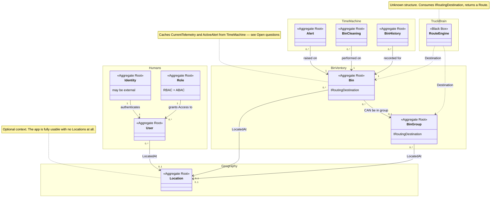

# Domain Model

Self-hosted garbage management system — bounded contexts, aggregates, and the
relationships between them.

> [!warning] This is not documentation of the current codebase.
> It describes the **desired** state of the domain, not what is implemented today.
> The project is in active development and `src/` lags behind — when the two
> disagree, the code is the thing that's wrong. See [README.md](README.md) for the
> convention, and the status table at the bottom of this document for how far along
> each piece is.

Field-level definitions (properties, types, value objects) live in
[data-model.md](data-model.md). This document covers only the shape of the domain:
what the contexts are, what lives in each, and how they reference each other.

## Contexts

Five Bounded Contexts. Each has its own model and its own ubiquitous language; only
three of them are required for the system to function.

| Context | Status | Holds |
| --- | --- | --- |
| **Humans** | core | `Role`, `User`, `Identity` (Keycloak) |
| **BinVentory** | core | `Bin`, `BinGroup` |
| **TruckBrain** | core | `RouteEngine`, `Route` |
| **Geography** | optional | `Location` |
| **TimeMachine** | optional | `BinCleaning`, `BinHistory`, `Alert` |

**Geography** can be switched off entirely — the system is usable with zero
`Location`s, with bins addressed purely by their coordinates. Every reference to a
location is therefore nullable by design, not by accident.

**TimeMachine** can be switched off too: it holds the historical and event-shaped
records (telemetry history, cleaning log, alerts). Without it, a bin still has a
current state; it just has no past.

## Diagram

## Humans (core)

**`Identity`** — Authentication, delegated to **Keycloak**. The domain stores no
credential of any kind; `User` keeps only the profile and authorization data that
belong to this system, linked to a Keycloak subject.

**`Role`** — A named bundle of `Access` entries, each pairing a resource with the
actions allowed on it. Roles are a convenience for assigning the same access to many
users, not the authorization mechanism itself — `Access` is.

Authorization is **RBAC and ABAC together, or either one alone**. An operator can run
with roles only, with attribute rules only, or with both layered. Which the market
actually wants is unknown, so the model keeps all three viable rather than committing
early.

`Resource` is shared vocabulary, but each module declares the resources it owns —
BinVentory says `bin` exists, Humans never learns what a bin is. The full list is
composed at startup for role-building UIs. See
[data-model.md](data-model.md) for the mechanism.

**`User`** — A person in the system. Effective permissions are computed, not stored:
`Role.Access` merged with the user's own `DedicatedAccess`, so a single user can be
granted something without inventing a role for them. `IsRoot` is the escape hatch that
bypasses the check. Soft-deleted with a 7-day retention window before the record
actually goes.

A `User` is optionally `LocatedAt` a `Location` — the field is meaningless when
Geography is disabled.

## BinVentory (core)

**`Bin`** — The physical container, and the center of the model. Carries its own
coordinates so it is addressable with Geography switched off, its lifecycle `State`
(`Working` / `Cleaning` / `NotAvailable` / `Disabled`), and its `BinType`
(`Dumpster` / `CityBin`). It also caches the latest telemetry reading and the
currently-open alert for read performance.

**`BinGroup`** — A cluster of bins collected at one point — the case where a truck
servicing one of them services all of them, so routing should treat them as a single
stop. Holds a cached fill level computed from its members.

Both implement **`IRoutingDestination`**: the contract TruckBrain consumes. That is
the whole of the coupling between BinVentory and TruckBrain — a destination is a point
with a fill level and an id, not a `Bin`.

## Geography (optional)

**`Location`** — A named place: a city, or a sub-area of one when a city is too large
to be covered as a single unit. Self-referencing via `ParentLocationId`, so the
hierarchy is arbitrarily deep without a separate `Area` type. A location is either a
single point or, given three or more points, an area.

Nothing in the system requires a `Location` to exist. `User`, `Bin`, and `BinGroup`
all reference it optionally, and disabling the context means those references are
simply never set.

## TimeMachine (optional)

Historical data only. BinVentory stays the source of truth for what is true *now* —
a bin's current telemetry, its open alert, when it was last cleaned all live on `Bin`.
TimeMachine exists so the record of what *was* true doesn't overwhelm the core.

That split is why the context is optional: history is the expensive part of the system,
most of it never read, and an operator who doesn't want to pay for it can switch
TimeMachine off and keep a fully working system.

**`BinCleaning`****`BinCleaning`** — A fact: this bin was emptied at this time.

**`BinHistory`** — The telemetry log: one `BinState` reading per entry. This is the
high-volume table in the system, and the reason the context is separable — it is a
natural candidate for a time-series store rather than the relational one.

**`Alert`** — Raised when a bin needs attention: `AlmostFull`, `Disconnected`,
`SmokeDetected`, `LifeDetected`, `RealShitDetected`. Unlike the other two it has a
lifecycle — it is resolved, at a time, by a user — which makes it the one aggregate
here with an invariant worth protecting.

## TruckBrain (core)

**`RouteEngine`** — A black box. Its internal structure is deliberately undecided:
route optimization is an algorithmic and geospatial problem, not a transactional one,
and it is expected to own storage suited to that.

What it must not do is reach into the other contexts. Its input is a set of
`IRoutingDestination`s plus explicit business constraints (shift length, alert
priority weighting, location eligibility) passed in as parameters. Its output is a
`Route` — an ordered list of destinations. Constraints are domain rules even though
the solver is not; they belong on the wire, not hardcoded in the algorithm.

Live driver positions and the continuous tracking stream stay inside TruckBrain. The
domain receives discrete facts back, never the raw feed.

## Open questions

- **`Route` ownership** — `Route` is listed under TruckBrain, but it's the one
  RouteEngine output the rest of the system needs to read (which truck goes where,
  in what order). Decide whether it's a TruckBrain aggregate the core queries, or a
  core aggregate TruckBrain writes into.

- **Attribute rules have no representation yet** — `Access` is `(Resource, Actions)`
  with no attributes, so it can express "drivers may read bins" but not "drivers may
  read bins in their own location". Given `User.LocationId` exists, that second form
  is likely wanted. Adding a scope or predicate to `Access` and filtering in query
  handlers are different implementations, so this is worth settling before the
  permission check is built.

- **`BinGroup` and `Location`** — the canvas gives `BinGroup` a required
  `LocationId`, but Geography is optional. Either that reference is nullable like
  every other one, or `BinGroup` quietly depends on a context that can be turned off.

- **Group-level operations** — a `BinCleaning` and an `Alert` both pin to a single
  `Bin`. If a truck services a whole `BinGroup` as one stop, is that N cleanings or
  one group cleaning?

## Implementation status

Markers: ⚪ planned · 🟡 partial, diverges from this document · 🟢 matches this document.

| Context / Aggregate | Status | Notes                                           |
|---------------------|--------|-------------------------------------------------|
| Humans — `Identity` | ⚪      | Keycloak not integrated                         |
| Humans — `Role`     | 🟡     | Exists as a `UserRole` enum, not `Access`-based |
| Humans — `User`     | 🟡     | Stores its own credentials                      |
| Geography           | ⚪      |                                                 |
| BinVentory          | 🟡     | `Bin` exists; no `BinGroup`                     |
| TimeMachine         | 🟡     | `Alert`, `CleaningLog` exist inside the core    |
| TruckBrain          | ⚪      |                                                 |
| Module separability | ⚪      | Contexts are not separable in `src/` yet        |

`src/` also contains `ShiftLog`, which has no counterpart in this model — shifts were
dropped from the target domain and the type is expected to go with the refactor.
